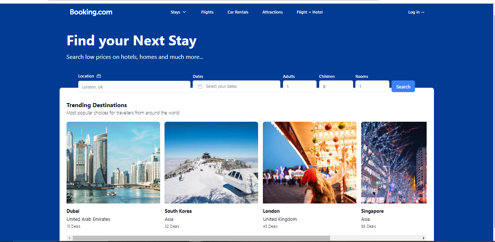

# Booking.com 2.0 - Next.js 14 Project with Data Scraping using Oxylabs

## Overview
Welcome to Booking.com 2.0, a revamped version of the popular travel booking platform built using cutting-edge technologies. This project utilizes NEXT.JS 14, Oxylabs for web scraping, React, Shadcn for state management, Tailwind CSS for styling, and TypeScript for type-safe development.

## Table of Contents
- Features
- Prerequisites
- Installation
- Configuration
- Usage
- Additional Notes 
- Demo of the project
- Contributing

## Features
1. NEXT.JS 14: Take advantage of the latest features and improvements in the NEXT.JS framework for building efficient and scalable web applications.

2. Oxylabs Web Scraping: Integrate Oxylabs to scrape data efficiently, ensuring up-to-date information for a seamless user experience.

3. React: Leverage the power of React to build dynamic and responsive user interfaces for an engaging user experience.

4. Shadcn State Management: Utilize Shadcn for state management, ensuring a predictable and efficient data flow within your application.

5. Tailwind CSS: Employ Tailwind CSS for a utility-first styling approach, making it easy to create visually appealing and consistent designs.

6. TypeScript: Enhance your development workflow with TypeScript, providing static typing for a more robust and maintainable codebase.


## Prerequisites
- Ensure you have Node.js installed on your machine.
- You need to have an Oxylabs account and API key for data scraping. Refer to [Oxylabs Documentation](https://docs.oxylabs.io/) for more information.

Before you begin, ensure you have the following installed on your system:

```
Node.js (>=14.0.0)
npm (>=6.0.0)
Oxylabs API key (for web scraping)
```

## Installation

1. Clone the repository:

    ```bash
    gh repo clone CSEcoolgamer/Booking-clone
    ```

2. Navigate to the project directory:

    ```bash
    cd booking-clone
    ```

3. Install dependencies:

    ```bash
    npm install
    ```

4. Set up environment variables:

    Create a `.env` file in the root of the project and add the following:

    ```env
    OXYLABS_API_KEY=your-oxylabs-api-key
    ```

    Replace `your-oxylabs-api-key` with your actual Oxylabs API key.

## Usage

1. Start the development server:

    ```bash
    npm run dev
    ```

2. Open your browser and visit [http://localhost:3000](http://localhost:3000) to view the application.

## Additional Notes

- This project utilizes Oxylabs for web scraping. Ensure you have the necessary permissions and adhere to Oxylabs' terms of service.
- Custom libraries or tools like Shadcn should be documented separately or replaced with actual details.
# 
# DEMO OF THE PROJECT:


#
## Contributing
- Contributions are welcome! If you find any issues or have improvements to suggest, please open an issue or create a pull request.
